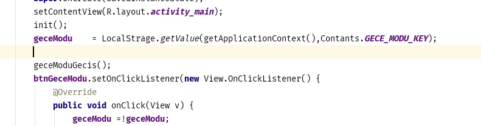
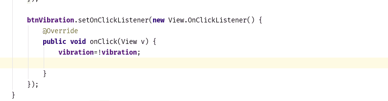

How to using | Kullanımı

Get | Kaydedilmiş bir veriyi çağırmak

Set | Bir veriyi kayıt etmek

How to Install

In your project build.gradle. Add the following lines

Step 1. Add the JitPack repository to your build file

	allprojects {
		repositories {
			...
			maven { url 'https://jitpack.io' }
		}
	}
Step 2. Add the dependency

	dependencies {
	        implementation 'com.github.mirzaKarahan:Android-LocalStrage:1.3'
	}
